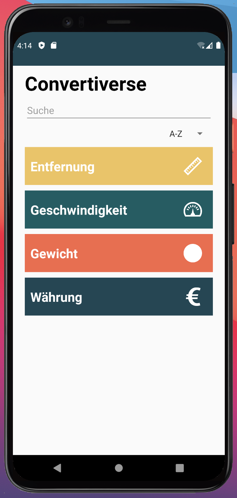
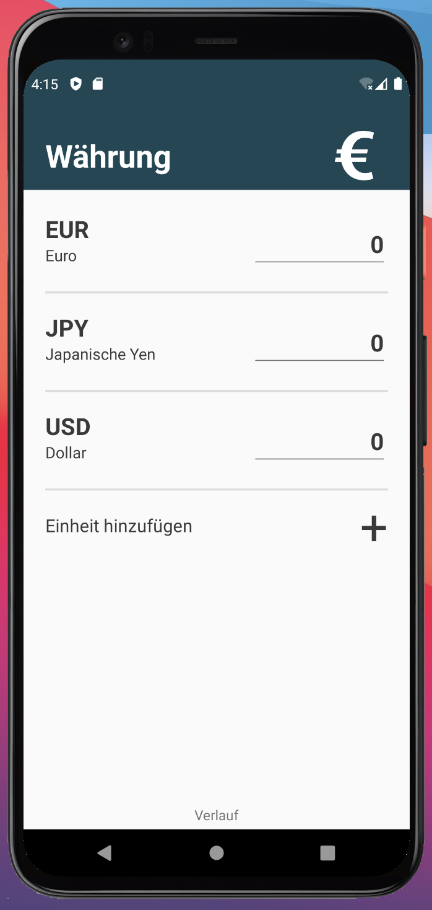
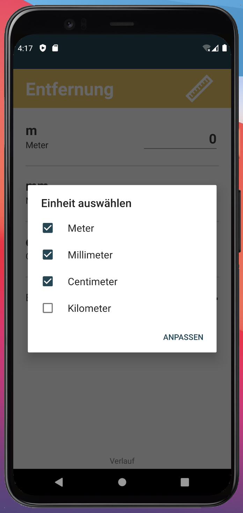
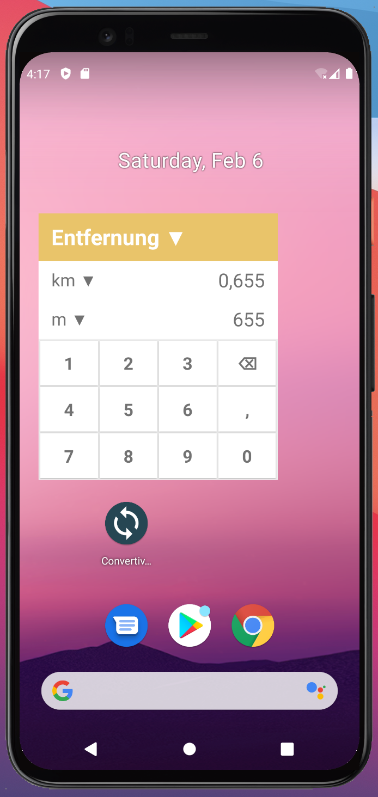

# Convertiverse

  Convertiverse = Converter + Universe  
Convertiverse ist eine Android App mit der verschiedene Kategorien (Währung, Entfernung, Gewicht, ...) umgerechnet werden können.     

## Screenshots

  

